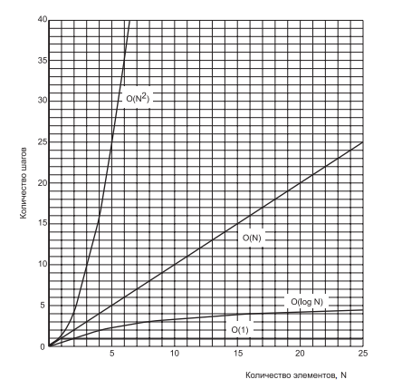

## Arrays

 - How to run **Array** applet:
 
   ```
   appletviewer http://cs.brynmawr.edu/Courses/cs206/spring2004/WorkshopApplets/Chap02/Array/Array.html
   ```
   
 - How to run **OrderedArray** applet:
    
      ```
      appletviewer http://cs.brynmawr.edu/Courses/cs206/spring2004/WorkshopApplets/Chap02/OrderedArray/Ordered.html
      ```
     
***
      
 **Упорядоченный массив**
> Массив, в котором элементы данных отсортированы по возрастанию ключевых значений — элемент с минимальным значением имеет индекс 0,
> а в каждой последующей ячейке ключевое значение больше, чем в предыдущей.Такие массивы называются упорядоченными.
> При вставке нового элемента в упорядоченный массив необходимо найти для него подходящую позицию: за ближайшим меньшим значением и 
> перед ближайшим большим. Далее все большие значения сдвигаются к концу массива, освобождая место для нового элемента.
> Для чего хранить упорядоченные данные? Одно из преимуществ такого способа хранения — радикальное ускорение поиска за счет применения двоичного поиска

***

**Двоичный поиск (бинарный поиск) O(log N)**
```java
public int find(long searchKey){
    int lowerBound = 0;
    int upperBound = nElems-1;
    int curIn;
    while(true){
        curIn = (lowerBound + upperBound ) / 2;
        if(a[curIn]==searchKey)
            return curIn;                    // Элемент найден
        else if(lowerBound > upperBound)
            return nElems;                   // Элемент не найден
        else{                                // Деление диапазона
            if(a[curIn] < searchKey)
                lowerBound = curIn + 1;       // В верхней половине
            else
                upperBound = curIn - 1;       // В нижней половине
         }
    }
}
```
 - В самом начале метода переменным **lowerBound** и **upperBound** приисваиваются индексы первой и последней занятой ячейки массива.
 - Затем в цикле while текущий индекс **curIn** устанавливается в середину этого диапазона.
 - Если элемент найден, мы возвращаем его индекс **curIn**.
 - В конечном итоге он сократится настолько, что дальнейшее деление станет невозможным. 
   Эта ситуация проверяется в следующей команде: если **lowerBound** больше **upperBound**, значит, поиск завершен.
 - При каждой итерации цикла диапазон уменьшается вдвое.
 
 ***
 
 **Логарифмы**
 
 | **Диапазон**        | **Необходимо сравнений**|
 | ------------------- |:----------------------- |
 | 10                  | 4                   	 |
 | 100                 | 7                   	 |
 | 1 000               | 10                  	 |
 | 10 000              | 14                  	 |
 | 100 000             | 17                  	 |
 | 1 000 000           | 20                  	 |
 | 10 000 000          | 24                  	 |
 | 100 000 000         | 27                  	 |
 | 1 000 000 000       | 30                   	 |
   
Если **s** — количество шагов (количество умножений на 2, то есть степень, в которую возводится 2), 
а **r** — размер диапазона, то формула выглядит так:
 **r = 2^s**
Обычно логарифм вычисляет по основанию 10, но результат легко преобразуется к основанию
2 — достаточно умножить его на 3,322. Например, log10(100) = 2; следовательно,
  
   **Как вычислить необходимое количество шагов**   
  > log2(10) = 1 × 3.322 = 3.322 = 4     
  > log2(100) = 2 × 3.322 = 6.644 = 7     
  > log2(1000) = 3 * 3.322 = 9.966 = 10   
  > log2(10000) = 4 * 3.322 = 13.288 = 14   
  > log2(100000) = 5 * 3.322 = 16.61 = 17   
  > log2(1000000) = 6 * 3.322 = 19.932 = 20
  
   ***
  
 **O-синтаксис** 
 
**«O-синтаксисе» используется прописная буква «O»; считайте, что он обозначает «порядок» (Order of). В «O-синтаксисе»**  

**Вставка в неупорядоченный массив** — единственный из рассмотренных нами алгоритмов, не зависящих 
от количества элементов в массиве. Новый элемент всегда размещается в следующей свободной ячейке ,
после чего значение nElems увеличивается. Вставка всегда выполняется с постоянной скоростью независимо
от **N** — количества элементов в массиве

**Линейный поиск** - сложность пропорциональна **N** Мы уже видели, что при линейном поиске элементов 
в массиве количество сравнений для поиска заданного значения в среднем составляет половину от общего
количества элементов. Таким образом, если **N** — общее количество элементов, 
то время поиска **T** пропорционально половине **N**

**Двоичный поиск**: сложность пропорциональна log(N). 
Как было показано ранее, время пропорционально логарифму N по основанию 2.
Но так как любой логарифм прямо пропорционален логарифму по другому осно ванию 
**(коэффициент 3,322 для перехода от двоичного логарифма к десятичному)**,
эту константу тоже можно внести в K; а следовательно, указывать основание логарифма не обязательно:
T = log(N).

| Алгоритм                           | Время выполнения в O-синтаксисе|
| ---------------------------------- |:-------------------------------|
| Линейный поиск                     | O(N)                		      |
| Двоичный поиск                     | O(log N)              		  |
| Вставка в неупорядоченном массиве  | O(1)                  		  |
| Вставка в упорядоченном массиве    | O(N)                 		  |
| Удаление в неупорядоченном массиве | O(N)                  		  |
| Удаление в упорядоченном массиве   | O(N)                  		  |


**Оценка сложности алгоритма:** 
  - O(1) — отлично
  - O(log N) — хорошо
  - O(N) —неплохо
  - O(N2) — плохо
  
  
  
  
  