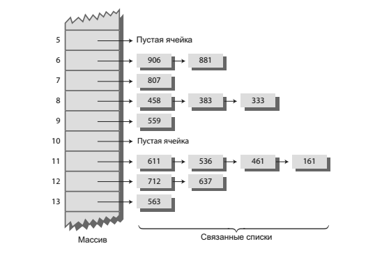

## Hash Tables

 - How to run **Hash table** applets:
    
      ```
      appletviewer http://cs.brynmawr.edu/Courses/cs206/spring2004/WorkshopApplets/Chap11/Hash/Hash.html
      appletviewer  http://cs.brynmawr.edu/Courses/cs206/spring2004/WorkshopApplets/Chap11/HashDouble/HashDouble.html
      appletviewer http://cs.brynmawr.edu/Courses/cs206/spring2004/WorkshopApplets/Chap11/HashChain/HashChain.html
      ```

- Хеш-таблицей называется структура данных, обеспечивающая очень быструю вставку и поиск.
- Независимо от количества элементов данных `вставка и поиск (а иногда и удаление)` выполняются за время, близкое к постоянному: O(1) в O-синтаксисе.
- Хеш-таблицы по скорости значительно превосходят деревья.
- У хеш-таблиц также имеются свои недостатки. Они реализуются на базе массивов, а массивы трудно расширить после создания.

<h3>Хеширование</h3>

`Хеш-функции` — функции, преобразующей число из большего диапазона в число из меньшего диапазона. Меньший диапазон
соответствует индексам массива. Массив, в который вставляются данные с использованием хеш-функции, называется `хеш-таблицей`.

Основной целью хеш-функции является преобразование диапазона ключей в диапазон индексов, обеспечивающее равномерное распределение ключей по индексам хеш-таблицы.

<h2>Коллизии</h2>

Предположим, в массив вставляется слово melioration. Слово хешируется, вы вычисляете его индекс — и тут выясняется, что ячейка с этим индексом уже занята
словом demystify, которое имеет точно такой же хеш-код.

Может показаться, что из-за возможности коллизий вся схема хеширования теряет смысл, но у проблемы существует несколько обходных решений.
При определении массива количество зарезервированных ячеек вдвое превышало количество элементов данных. Таким образом, приблизительно
половина ячеек остается пустой. Одно из возможных решений при возникновении коллизии заключается в систематизированном поиске пустой ячейки и вставке
нового элемента в нее (вместо индекса, полученного в результате примененияхеш-функции). 
Такое решение называется `открытой адресацией`. Если слово cats хешируется в индекс 5421, а эта ячейка уже занята словом parsnip, можно попы-
таться вставить cats в другую ячейку, например 5422.

Во втором решении создается массив, содержащий связанные списки слов вместо самих слов. При возникновении коллизии новый
элемент просто вставляется в список с соответствующим индексом. Этот метод называется `методом цепочек`.

<h3>Открытая адресация</h3>

Если элемент данных не удается разместить в ячейке с индексом, вычисленным по-
средством хеш-функции, метод открытой адресации ищет в массиве другую ячейку.

Способы поиска следующей свободной ячейки: 
- линейное пробирование
- квадратичное пробирование
- двойное хеширование

<h4>Линейное пробирование</h4>

Алгоритм линейного пробирования последовательно ищет пустые ячейки. Если при попытке вставки элемента выясняется, что ячейка 5421 занята, мы переходим
к ячейке 5422, затем к ячейке 5423 и т. д. Индекс последовательно увеличивается до тех пор, пока не будет найдена пустая ячейка. Процедура поиска называется
«линейным пробированием», потому что она основана на линейной проверке последовательности ячеек.

При проектировании хеш-таблицы очень важно позаботиться о том, чтобы таблица никогда не заполнялась более чем наполовину или по крайней мере на две трети.

<h4>Квадратичное пробирование</h4>

При линейном пробировании, если первичный индекс хеширования равен x, то последующие пробы проверяют позиции x + 1, x + 2, x + 3 и т. д. При квадратичном
пробировании проверяются позиции x + 1, x + 4, x + 9, x + 16, x + 25 и т. д. 
Расстояние от исходной позиции вычисляется как квадрат номера шага: x + 1^2, x + 2^2,x + 3^2, x + 4^2, x + 5^2и т. д.

<h4>Двойное хеширование</h4>

Используются две хеш-функции: для поиска начального индекса и для генерирования смещения.

```java
private int hashFunc1(int key){
        return key % arraySize;
    }

private int hashFunc2(int key){
    // Возвращаемое значение отлично от нуля, меньше размера массива,
    // функция отлична от хеш-функции 1
    // Размер массива должен быть простым по отношению к 5, 4, 3 и 2
    return 5 - key % 5;
}
```

При использовании двойного хеширования размер таблицы должен быть простым числом. Чтобы понять смысл этого требования, представьте ситуацию, в которой
размер таблицы простым числом не является. Предположим, размер массива равен 15 (индексы от 0 до 14), а конкретный ключ хешируется в исходный индекс 0
со смещением 5. Пробы будут выполняться в последовательности 0, 5, 10, 0, 5, 10 и т. д. до бесконечности. Проверяются только эти три ячейки, поэтому алгоритм
«не увидит» пустые ячейки 1, 2, 3 и т. д., а из попытки выполнения операции ничего не выйдет.

Если бы размер массива был равен 13 (простое число), то в процессе пробирования в конечном итоге была бы проверена каждая ячейка: 0, 5, 10, 2, 7, 12, 4, 9, 1, 6, 11,
3 и т. д. Даже если в массиве имеется всего одна пустая ячейка, она будет успешно обнаружена. Простой размер массива не делится нацело ни на какое число, поэтому
последовательность проб рано или поздно проверит каждую ячейку.

В общем случае при использовании открытой адресации предпочтение следует отдавать `двойному хешированию`.

<h3>Метод цепочек</h3>

Другое возможное решение основано на ведении отдельного связанного списка по каждому индексу в хеш-таблице.
Ключ элемента данных хешируется в индекс обычным способом, а полученный элемент вставляется в связанный
список по этому индексу. Другие элементы, хешируемые в тот же индекс, просто добавляются в связанный список;

