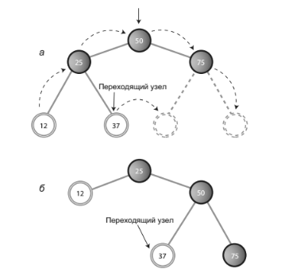

## Red black trees

 - How to run **Red black trees** applet:
 
   ```
   appletviewer http://cs.brynmawr.edu/Courses/cs206/spring2004/WorkshopApplets/Chap09/RBTree/RBTree.html
   ```
   
#### Характеристики красно-черного дерева  
Что же это за загадочные характеристики дерева? Их две — одна простая, а другая посложнее:
   - Каждый узел окрашен в определенный цвет.
   - В процессе вставки и удаления выполняются различные правила взаимного расположения этих цветов.
   
   
#### Красно-черные правила
При вставке (или удалении) узла должны выполняться некоторые правила. 
Если эти правила выполняются, дерево остается сбалансированным. Краткий перечень этих правил:
1. Каждый узел окрашен в красный или черный цвет.
2. Корень всегда окрашен в черный цвет.
3. Если узел красный, то его потомки должны быть черными (хотя обратное не
всегда истинно).
4. Все пути от корня к узлу или пустому потомку должны содержать одинаковое
количество черных узлов.

#### Повороты
Поворот должен:

1. поднять одни узлы и опустить другие, чтобы обеспечить сбалансированность дерева;
2. обеспечить соблюдение характеристик дерева двоичного поиска.
   
> Термин «поворот» можно понять неверно. Сами узлы сохраняют исходную ориентацию; изменяются лишь связи между ними.   
> Один узел выбирается в качестве «верхнего» узла поворота. При выполнении правого поворота «верхний» узел
> смещается вниз и вправо, в позицию своего правого потомка. Его левый потомок
> смещается вверх, занимая его место. Помните, что верхний узел не является «центром» поворота.




### Эффективность красно-черных деревьев

В красно-черных деревьях, как и в обычных деревьях двоичного поиска, `операции поиска, вставки и удаления` выполняются за время `O(log2N)`. Время поиска
в красно-черных деревьях практически неотличимо от времени поиска в обычном дереве, потому что при поиске красно-черные характеристики не используются.
Единственное отличие — небольшое увеличение затрат памяти на хранение признака красно-черного цвета (логическая переменная).

Время `удаления и вставки` возрастает с постоянным коэффициентом из-за необходимости выполнения переключений и поворотов при перемещении вниз
и в точке вставки. В среднем при вставке выполняется около одного поворота. 
Таким образом, сложность вставки тоже составляет `O(log2N)`, но операция выполняется медленнее вставки в обычном двоичном дереве.

### Итоги

- Дерево двоичного поиска должно быть сбалансированным, поскольку это гарантирует минимальное время поиска заданного узла.
- При вставке заранее отсортированных данных создается дерево с максимальной разбалансированностью, время поиска в котором составляет O(N).
- В красно-черной схеме балансировки каждому узлу присваивается новая характеристика: цвет (красный или черный).
- Допустимое взаиморасположение узлов разных цветов определяется наборомправил, называемых красно-черными правилами.
- Эти правила применяются при вставке (и удалении) узлов.
- Переключение цветов превращает черный узел с двумя красными потомками в красный узел с двумя черными потомками.
- При правом повороте верхний узел перемещается в позицию правого потомка, а левый потомок занимает его прежнее место.
- При левом повороте верхний узел перемещается в позицию левого потомка, а правый потомок занимает его прежнее место.
- После вставки нового узла снова производится проверка возможных конфликтов типа «красный-красный». Если будет обнаружено нарушение, выполняются повторы, возвращающие дерево к состоянию красно-черной правильности.