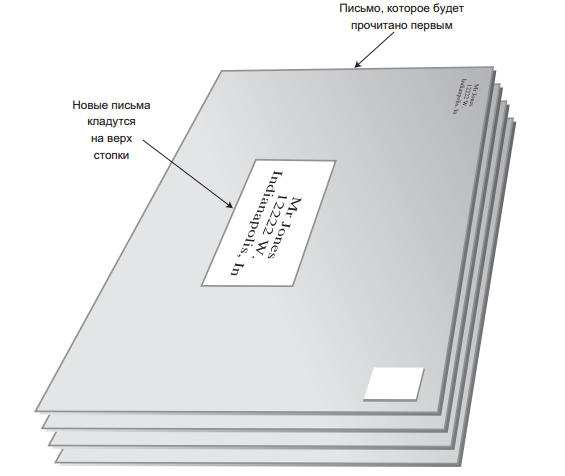

## Stack

 - How to run **Stack** applet:
 
   ```
   appletviewer http://cs.brynmawr.edu/Courses/cs206/spring2004/WorkshopApplets/Chap04/Stack/Stack.html
   ```
   
#### Почтовая аналогия

Для объяснения идеи стека лучше всего воспользоваться аналогией. Многие люди
складывают приходящие письма стопкой на журнальном столике. Когда появится
свободная минута, они обрабатывают накопившуюся почту сверху вниз. Сначала
они открывают письмо, находящееся на вершине стопки, и выполняют необходимое
действие — оплачивают счет, выбрасывают письмо и т. д. Разобравшись с первым
письмом, они переходят к следующему конверту, который теперь оказывается на
верху стопки, и разбираются с ним. В конечном итоге они добираются до нижнего
письма (которое теперь оказывается верхним).



Принцип «начать с верхнего письма» отлично работает, при условии, что вся
почта может быть обработана за разумное время. В противном случае возникает
опасность того, что письма в нижней части стопки не будут просматриваться месяцами, а содержащиеся в них счета будут просрочены.

_Если письма берутся снизу стопки, это `очередь`, а если сверху стопки - это `стэк`, а если почта сортируется — `приоритетная очередь`._

> **Основные операции со стеком — `вставка` (занесение) элемента в стек и `извлечение` из стека — выполняются только на вершине стека, то есть с его верхним элементом. 
> Говорят, что стек работает по принципу `LIFO (Last-In-First-Out`), потому
> что последний занесенный в стек элемент будет первым извлечен из него.**

**`Push`** - вставляет в стек новый элемент данных.

**`Pop`** - удаляет и возвращает элемент с вершины стека

**`Peek`** - прочитает значение с вершины стека без его удаления

Обратите внимание: «подсмотреть» можно только значение верхнего элемента.
Архитектура стека такова, что все остальные элементы остаются невидимыми для
пользователя.

#### Эффективность стеков
Занесение и извлечение элементов из стека, реализованного в классе StackX, выполняется за время `O(1)`. Иначе говоря, время выполнения операции не зависит от
количества элементов в стеке; следовательно, операция выполняется очень быстро,
не требуя ни сравнений, ни перемещений.